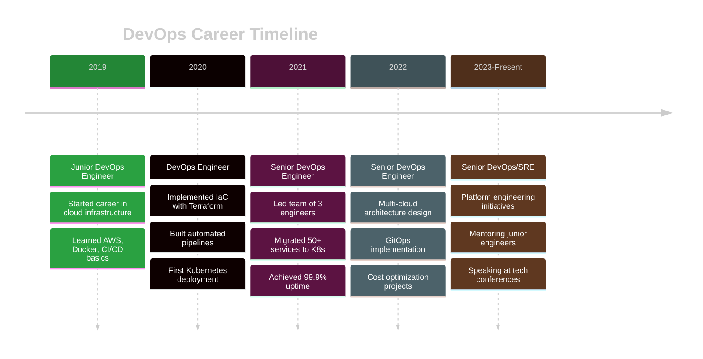

<div align="center">

<!-- Animated Wave Header -->


<br/>

<!-- Typing Animation -->
<a href="https://git.io/typing-svg"></a>

<br/>
<br/>

<!-- Social Badges -->
<p align="center">
  <a href="https://linkedin.com/in/your-profile"></a>
  <a href="mailto:your.email@example.com"></a>
  <a href="https://twitter.com/yourhandle"></a>
  <a href="https://your-blog.dev"></a>
</p>

<!-- Profile Views Counter with Animation -->


</div>

<br/>

---

<br/>

<!-- About Section with Custom Design -->
<div align="center">

## 🎯 ABOUT ME

<table>
<tr>
<td width="50%">

```yaml
name: Your Full Name
role: Senior DevOps Engineer
company: Tech Corp
location: San Francisco, CA
experience: 6+ years
specialization:
  - Cloud Infrastructure
  - Kubernetes Orchestration  
  - CI/CD Automation
  - Infrastructure as Code
  - Site Reliability Engineering
```

</td>
<td width="50%">

```yaml
philosophy: |
  "Automate everything,
   Monitor everything,
   Break things to make
   them unbreakable."

current_focus:
  - Multi-cloud architectures
  - GitOps workflows
  - Platform engineering
  - Cost optimization

availability: Open for consulting
```

</td>
</tr>
</table>

</div>

<br/>

---

<br/>

<!-- Key Metrics Section -->
<div align="center">

## 📊 CAREER HIGHLIGHTS

<table>
<tr>
<td align="center" width="25%">
<br/>
<b>500+</b><br/>
Deployments Automated
</td>
<td align="center" width="25%">
<br/>
<b>$200K+</b><br/>
Annual Cost Savings
</td>
<td align="center" width="25%">
<br/>
<b>85%</b><br/>
Faster Deployment
</td>
<td align="center" width="25%">
<br/>
<b>99.9%</b><br/>
System Uptime
</td>
</tr>
</table>

</div>

<br/>

---

<br/>

<!-- Technology Stack with Visual Organization -->
<div align="center">

## 🛠️ TECHNOLOGY ARSENAL

</div>

<details open>
<summary><b>☁️ CLOUD PLATFORMS</b></summary>
<br/>
<p align="center">
  
</p>
</details>

<details open>
<summary><b>🐳 CONTAINERS & ORCHESTRATION</b></summary>
<br/>
<p align="center">
  
  
  
  
  
  
</p>
</details>

<details open>
<summary><b>🔄 CI/CD & AUTOMATION</b></summary>
<br/>
<p align="center">
  
  
  
  
  
  
</p>
</details>

<details open>
<summary><b>📜 INFRASTRUCTURE AS CODE</b></summary>
<br/>
<p align="center">
  
  
  
  
  
  
</p>
</details>

<details open>
<summary><b>📊 MONITORING & OBSERVABILITY</b></summary>
<br/>
<p align="center">
  
  
  
  
  
  
  
  
</p>
</details>

<details open>
<summary><b>🗄️ DATABASES & STORAGE</b></summary>
<br/>
<p align="center">
  
  
  
  
  
</p>
</details>

<details open>
<summary><b>🔐 SECURITY & COMPLIANCE</b></summary>
<br/>
<p align="center">
  
  
  
  
  
  
  
</p>
</details>

<details open>
<summary><b>💻 PROGRAMMING & SCRIPTING</b></summary>
<br/>
<p align="center">
  
  
  
</p>
</details>

<details open>
<summary><b>🔧 TOOLS & PLATFORMS</b></summary>
<br/>
<p align="center">
  
  
  
  
  
  
</p>
</details>

<br/>

---

<br/>

<!-- Certifications with Visual Design -->
<div align="center">

## 🏆 PROFESSIONAL CERTIFICATIONS

<table>
<tr>
<td align="center" width="33%">
<br/>
<b>AWS Solutions Architect</b><br/>
<sub>Associate | 2023</sub><br/>
<a href="your-credly-link"></a>
</td>
<td align="center" width="33%">
<br/>
<b>Certified Kubernetes Admin</b><br/>
<sub>CKA | 2023</sub><br/>
<a href="your-credly-link"></a>
</td>
<td align="center" width="33%">
<br/>
<b>Azure DevOps Engineer</b><br/>
<sub>Expert | 2022</sub><br/>
<a href="your-credly-link"></a>
</td>
</tr>
<tr>
<td align="center" width="33%">
<br/>
<b>HashiCorp Terraform</b><br/>
<sub>Associate | 2022</sub><br/>
<a href="your-credly-link"></a>
</td>
<td align="center" width="33%">
<br/>
<b>Docker Certified</b><br/>
<sub>Associate | 2021</sub><br/>
<a href="your-credly-link"></a>
</td>
<td align="center" width="33%">
<br/>
<b>Linux Professional</b><br/>
<sub>LPIC-1 | 2020</sub><br/>
<a href="your-credly-link"></a>
</td>
</tr>
</table>

</div>

<br/>

---

<br/>

<!-- Experience Timeline -->
<div align="center">

## 💼 PROFESSIONAL JOURNEY

</div>



<br/>

<details>
<summary><b>🔹 Senior DevOps Engineer @ Tech Corp</b> | Jan 2022 - Present</summary>
<br/>

**Key Achievements:**
- 🚀 Led migration of 100+ microservices to Kubernetes, reducing infrastructure costs by 40%
- ⚡ Implemented GitOps workflow with ArgoCD, increasing deployment frequency from weekly to daily
- 🔒 Established DevSecOps practices, reducing critical vulnerabilities by 85%
- 📊 Built comprehensive observability stack (Prometheus + Grafana + Loki)
- 👥 Mentored team of 5 junior engineers, 2 promoted to mid-level
- 💰 Saved $200K+ annually through cloud cost optimization initiatives

**Technologies:** AWS, EKS, Terraform, ArgoCD, Jenkins, Python, Go, Prometheus, Grafana

</details>

<details>
<summary><b>🔹 DevOps Engineer @ StartupXYZ</b> | Jun 2019 - Dec 2021</summary>
<br/>

**Key Achievements:**
- 🔧 Automated CI/CD pipelines using GitLab CI, reducing deployment time by 85%
- ☁️ Managed hybrid infrastructure across AWS and Azure
- 📦 Containerized 30+ legacy applications using Docker
- 🛡️ Implemented infrastructure security scanning (Trivy + SonarQube)
- 📈 Maintained 99.95% uptime for production systems
- 🏗️ Built disaster recovery strategy with automated backups

**Technologies:** AWS, Azure, Docker, GitLab CI, Terraform, Ansible, Python

</details>

<details>
<summary><b>🔹 Junior DevOps Engineer @ TechStart</b> | Jan 2019 - May 2019</summary>
<br/>

**Key Achievements:**
- 🎓 Learned Infrastructure as Code principles with Terraform
- 🔄 Assisted in CI/CD pipeline setup and maintenance
- 📚 Gained hands-on experience with AWS core services
- 🤝 Collaborated with dev teams to optimize deployment processes
- 📝 Documented infrastructure setup and runbooks

**Technologies:** AWS, Jenkins, Docker, Bash, Linux

</details>

<br/>

---

<br/>

<!-- GitHub Stats Section with Custom Design -->
<div align="center">

## 📈 GITHUB STATISTICS

<table>
<tr>
<td width="50%">


</td>
<td width="50%">


</td>
</tr>
</table>


<details>
<summary><b>📊 More Statistics</b></summary>
<br/>


</details>

</div>

<br/>

---

<br/>

<!-- Featured Projects -->
<div align="center">

## 🚀 FEATURED PROJECTS

<table>
<tr>
<td width="50%">

[](https://github.com/YOUR_USERNAME/k8s-deployment-automation)

</td>
<td width="50%">

[](https://github.com/YOUR_USERNAME/terraform-aws-modules)

</td>
</tr>
<tr>
<td width="50%">

[](https://github.com/YOUR_USERNAME/cicd-pipeline-templates)

</td>
<td width="50%">

[](https://github.com/YOUR_USERNAME/observability-stack)

</td>
</tr>
</table>

### 🌟 Other Notable Projects

- **[GitOps-ArgoCD-Demo](https://github.com/YOUR_USERNAME/gitops-argocd)** - Complete GitOps workflow with ArgoCD ⭐ 250
- **[AWS-Cost-Optimizer](https://github.com/YOUR_USERNAME/aws-cost-optimizer)** - Automated cost optimization tool ⭐ 180
- **[K8s-Security-Scanner](https://github.com/YOUR_USERNAME/k8s-security)** - Security scanning for Kubernetes clusters ⭐ 160
- **[Multi-Cloud-IaC](https://github.com/YOUR_USERNAME/multicloud-iac)** - Infrastructure as Code for AWS, Azure, GCP ⭐ 140

</div>

<br/>

---

<br/>

<!-- Blog & Articles -->
<div align="center">

## ✍️ LATEST BLOG POSTS

<!-- BLOG-POST-LIST:START -->
- 🔄 [Building Production-Ready GitOps Workflows with ArgoCD](https://your-blog.dev/gitops-argocd)
- 🎯 [Kubernetes Cost Optimization: 10 Proven Strategies](https://your-blog.dev/k8s-cost-optimization)
- 🔐 [Implementing Zero-Trust Security in Kubernetes](https://your-blog.dev/zero-trust-k8s)
- ☁️ [Multi-Cloud Architecture: Lessons from the Trenches](https://your-blog.dev/multicloud-architecture)
- 🚀 [From CI to CD: Building Reliable Deployment Pipelines](https://your-blog.dev/cicd-pipelines)
<!-- BLOG-POST-LIST:END -->

[➡️ **Read More Articles**](https://your-blog.dev)

</div>

<br/>

---

<br/>

<!-- Skills Matrix -->
<div align="center">

## 💡 EXPERTISE MATRIX

<table>
<tr>
<td>

**CLOUD PLATFORMS**
```
AWS         ████████████████████ 100%
Azure       █████████████████░░░  85%
GCP         ████████████████░░░░  80%
```

</td>
<td>

**ORCHESTRATION**
```
Kubernetes  ████████████████████ 100%
Docker      ████████████████████ 100%
Helm        ██████████████████░░  90%
```

</td>
</tr>
<tr>
<td>

**AUTOMATION**
```
Terraform   ████████████████████ 100%
Ansible     ██████████████████░░  90%
Jenkins     █████████████████░░░  85%
```

</td>
<td>

**MONITORING**
```
Prometheus  ████████████████████ 100%
Grafana     ███████████████████░  95%
ELK Stack   ██████████████████░░  90%
```

</td>
</tr>
<tr>
<td>

**PROGRAMMING**
```
Python      ████████████████████ 100%
Bash        ████████████████████ 100%
Go          ████████████████░░░░  80%
```

</td>
<td>

**DATABASES**
```
PostgreSQL  ██████████████████░░  90%
MongoDB     █████████████████░░░  85%
Redis       ████████████████░░░░  80%
```

</td>
</tr>
</table>

</div>

<br/>

---

<br/>

<!-- Achievements -->
<div align="center">

## 🎯 KEY ACHIEVEMENTS & IMPACT

</div>

<table>
<tr>
<td width="50%">

### 💰 COST OPTIMIZATION
```diff
+ Reduced cloud spend by $200K+ annually
+ Implemented right-sizing recommendations
+ Automated resource cleanup processes
+ Negotiated better cloud pricing contracts
```

### 🚀 PERFORMANCE
```diff
+ Reduced deployment time from 4h to 15min
+ Improved system response time by 60%
+ Achieved 99.95% uptime SLA
+ Zero downtime deployments
```

</td>
<td width="50%">

### 🔒 SECURITY
```diff
+ Reduced critical vulnerabilities by 85%
+ Implemented automated security scanning
+ Achieved SOC2 compliance
+ Zero security incidents in production
```

### 📈 AUTOMATION
```diff
+ Automated 90% of manual tasks
+ Built self-service deployment platform
+ Created 50+ reusable IaC modules
+ Reduced MTTR from 2h to 15min
```

</td>
</tr>
</table>

<br/>

---

<br/>

<!-- 2025 Goals -->
<div align="center">

## 🎯 2025 ROADMAP

</div>

<table>
<tr>
<td width="33%">

### 📚 LEARNING
- [ ] CKAD Certification
- [ ] AWS Advanced Networking
- [ ] eBPF & Cilium
- [ ] Rust for Systems
- [ ] WebAssembly

</td>
<td width="33%">

### 🚀 BUILDING
- [ ] Open-source IaC library
- [ ] Cost optimization platform
- [ ] K8s security scanner
- [ ] DevOps learning content
- [ ] Conference talks (3+)

</td>
<td width="33%">

### 🤝 CONTRIBUTING
- [ ] 10+ OSS contributions
- [ ] Mentor 5+ engineers
- [ ] Write 24 blog posts
- [ ] YouTube tutorials
- [ ] Community workshops

</td>
</tr>
</table>

<br/>

---

<br/>

<!-- Speaking & Community -->
<div align="center">

## 🎤 SPEAKING & COMMUNITY

**Conference Talks:**
- 🎯 KubeCon 2023 - "Scaling Kubernetes: Real-World Challenges"
- ☁️ AWS re:Invent 2022 - "Multi-Region Disaster Recovery Patterns"
- 🔧 DevOpsDays 2021 - "From Manual to Fully Automated Deployments"

**Community Involvement:**
- 📝 Regular contributor to CNCF projects
- 👥 Organizer of local DevOps meetup (500+ members)
- 🎓 Mentor on ADPList and MentorCruise
- 💬 Active on DevOps-focused Discord/Slack communities

</div>

<br/>

---

<br/>

<!-- Fun Stats -->
<div align="center">

## 🎮 CODING ACTIVITY

<!--START_SECTION:waka-->
<!--END_SECTION:waka-->

<details>
<summary><b>⚡ Recent GitHub Activity</b></summary>
<br/>

<!--START_SECTION:activity-->
<!--END_SECTION:activity-->

</details>

</div>

<br/>

---

<br/>

<!-- Contact Section with Style -->
<div align="center">

## 📫 LET'S CONNECT


<br/><br/>

<table>
<tr>
<td align="center" width="25%">
<a href="mailto:your.email@example.com">
<br/>
<b>Email</b><br/>
<sub>your.email@example.com</sub>
</a>
</td>
<td align="center" width="25%">
<a href="https://linkedin.com/in/your-profile">
<br/>
<b>LinkedIn</b><br/>
<sub>Connect with me</sub>
</a>
</td>
<td align="center" width="25%">
<a href="https://twitter.com/yourhandle">
<br/>
<b>Twitter</b><br/>
<sub>@yourhandle</sub>
</a>
</td>
<td align="center" width="25%">
<a href="https://your-blog.dev">
<br/>
<b>Blog</b><br/>
<sub>Read my articles</sub>
</a>
</td>
</tr>
</table>

<br/>

### 💼 OPEN FOR

<p>


</p>

</div>

<br/>

---

<br/>

<!-- Fun Section -->
<div align="center">

## 🎪 FUN FACTS ABOUT ME

```javascript
const devOpsEngineer = {
  name: "Your Name",
  pronouns: "he/him",
  code: ["Python", "Go", "Bash", "YAML"],
  tools: ["Kubernetes", "Terraform", "Docker", "AWS"],
  architecture: ["Microservices", "Event-Driven", "Serverless"],
  
  motto: "Automate everything, monitor everything, break things safely",
  
  funFacts: {
    coffee: "☕ Coffee-driven development",
    hobbies: ["🏃 Marathon running", "🎸 Playing guitar", "📚 Reading sci-fi"],
    superpower: "Turning 'it works on my machine' into 'it works everywhere'",
    weekendProject: "Building a smart home automation system",
    favoriteCommand: "kubectl get pods --all-namespaces",
    dreamJob: "Working at CNCF on cloud-native tools"
  },
  
  askMeAbout: [
    "Kubernetes at scale",
    "Multi-cloud strategies",
    "Cost optimization techniques",
    "Building reliable CI/CD pipelines",
    "DevOps best practices"
  ],
  
  currentlyLearning: ["Rust", "eBPF", "Service Mesh", "Platform Engineering"],
  
  timezone: "America/Los_Angeles",
  availability: "UTC -8 | Usually online 9 AM - 6 PM PST"
};
```

</div>

<br/>

---

<br/>

<!-- Quote -->
<div align="center">

### 💭 DAILY INSPIRATION


</div>

<br/>

---

<br/>

<!-- Support Section -->
<div align="center">

## ☕ SUPPORT MY WORK

If you find my open-source projects helpful, consider buying me a coffee!

<a href="https://www.buymeacoffee.com/yourname">

</a>

</div>

<br/>

---

<br/>

<!-- Trophy Section -->
<div align="center">

## 🏆 GITHUB TROPHIES


</div>

<br/>

---

<br/>

<!-- Footer -->
<div align="center">


<br/>

**⭐️ From [YOUR_USERNAME](https://github.com/YOUR_USERNAME) with ❤️ and ☕**

<sub>Last updated: December 2024</sub>

<br/>


</div>
