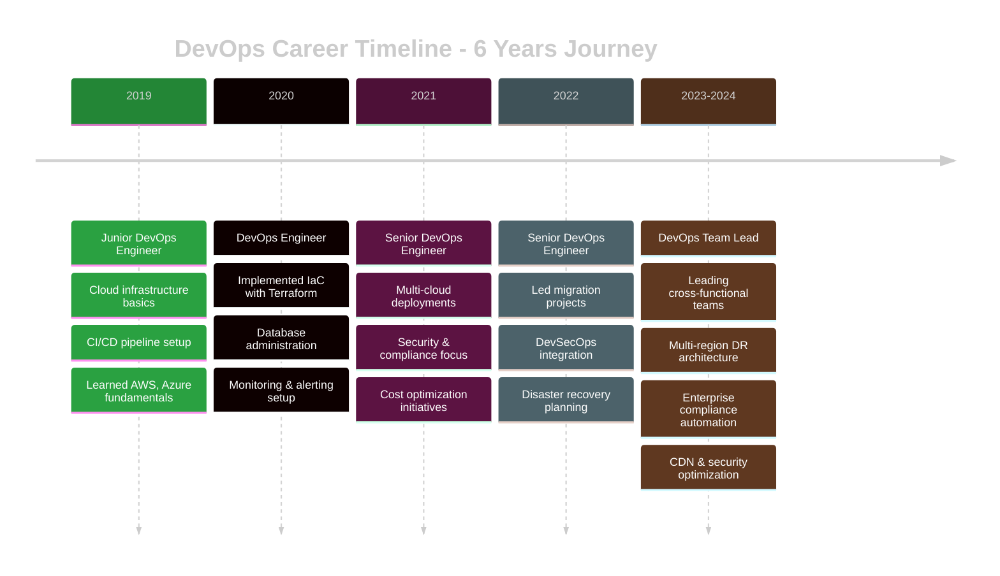

<div align="center">

<!-- Animated Wave Header -->


<br/>

<!-- Typing Animation -->
<a href="https://git.io/typing-svg"></a>

<br/>
<br/>

<!-- Social Badges -->
<p align="center">
  <a href="https://linkedin.com/in/your-profile"></a>
  <a href="mailto:your.email@example.com"></a>
  <a href="https://twitter.com/yourhandle"></a>
  <a href="https://your-blog.dev"></a>
</p>

<!-- Profile Views Counter -->


</div>

<br/>

---

<br/>

<!-- About Section -->
<div align="center">

## 👨‍💻 PROFESSIONAL SUMMARY

</div>

> **DevOps Team Lead** with over **6 years of experience** delivering reliable and secure infrastructure solutions across multiple cloud platforms. Proven expertise in designing and maintaining CI/CD pipelines, automating infrastructure with IaC, and integrating security & compliance into deployment workflows. Skilled in monitoring, incident response, cloud cost optimization, and leading cross-functional teams to deliver scalable, high-availability systems.

<table>
<tr>
<td width="50%">

```yaml
name: Your Name
role: DevOps Team Lead
location: India
experience: 6+ years
current_company: ABC Company

expertise:
  - Multi-Cloud Architecture
  - CI/CD Pipeline Design
  - Infrastructure as Code
  - Security & Compliance
  - Team Leadership
```

</td>
<td width="50%">

```yaml
specialization:
  - AWS, Azure, GCP deployments
  - Jenkins, Azure DevOps automation
  - Terraform, ARM templates
  - SOC2, ISO 27001, GDPR
  - Cost optimization strategies
  - Incident management & monitoring

current_focus:
  - DevSecOps integration
  - Multi-region DR strategies
  - Cloud-native security
```

</td>
</tr>
</table>

<br/>

---

<br/>

<!-- Key Metrics -->
<div align="center">

## 📊 CAREER IMPACT & ACHIEVEMENTS

<table>
<tr>
<td align="center" width="25%">
<br/>
<b>40%</b><br/>
Faster Deployments
</td>
<td align="center" width="25%">
<br/>
<b>95%</b><br/>
Reduced Manual Errors
</td>
<td align="center" width="25%">
<br/>
<b>20%+</b><br/>
Cost Reduction
</td>
<td align="center" width="25%">
<br/>
<b>99.9%</b><br/>
System Uptime
</td>
</tr>
</table>

</div>

<br/>

---

<br/>

<!-- Core Competencies -->
<div align="center">

## 🛠️ CORE COMPETENCIES & TECHNOLOGY STACK

</div>

<details open>
<summary><b>☁️ CLOUD PLATFORMS</b></summary>
<br/>
<p align="center">
  
  
</p>

**Primary Clouds:** AWS • Azure • GCP  
**Services:** EC2, S3, Lambda, Azure VMs, App Services, GCP Compute, Cloud Functions
</details>

<details open>
<summary><b>🔄 CI/CD & AUTOMATION TOOLS</b></summary>
<br/>
<p align="center">
  
  
  
  
</p>

**Tools:** Jenkins • Azure DevOps • GitHub Actions • Bitbucket Pipelines  
**Focus:** Automated deployments, testing, security scanning, release management
</details>

<details open>
<summary><b>📜 INFRASTRUCTURE AS CODE</b></summary>
<br/>
<p align="center">
  
  
  
</p>

**Tools:** Terraform • ARM Templates • Azure Bicep  
**Approach:** Standardized provisioning, version-controlled infrastructure, policy enforcement
</details>

<details open>
<summary><b>💻 SCRIPTING & AUTOMATION</b></summary>
<br/>
<p align="center">
  
  
</p>

**Languages:** PowerShell • Bash/Shell • Python (for automation)  
**CLI Tools:** Azure CLI • AWS CLI • gcloud
</details>

<details open>
<summary><b>🗄️ DATABASE ADMINISTRATION</b></summary>
<br/>
<p align="center">
  
  
</p>

**Databases:** MongoDB • MS-SQL • MySQL • PostgreSQL  
**Skills:** Backup automation, recovery processes, performance tuning, cluster optimization
</details>

<details open>
<summary><b>📊 MONITORING & OBSERVABILITY</b></summary>
<br/>
<p align="center">
  
  
  
  
</p>

**Tools:** Datadog • ELK Stack (Elasticsearch, Logstash, Kibana) • Site 24x7 • Cloudflare Analytics  
**Capabilities:** Centralized monitoring, alerting, dashboards, incident detection, proactive management
</details>

<details open>
<summary><b>🔐 SECURITY & COMPLIANCE</b></summary>
<br/>
<p align="center">
  
  
  
  
</p>

**Standards:** SOC2 • ISO 27001 • GDPR best practices  
**Tools:** Cloudflare WAF • Custom Firewall Rules • DevSecOps SAST/DAST  
**Focus:** Policy-as-code, certificate management, security hardening
</details>

<details open>
<summary><b>🔧 ADDITIONAL SKILLS</b></summary>
<br/>
<p align="center">
  
  
  
  
  
</p>

**Skills:** Office 365 Administration • Cost Optimization • Cloud Networking • CDN Management • Disaster Recovery
</details>

<br/>

---

<br/>

<!-- Certifications -->
<div align="center">

## 🏆 MICROSOFT CERTIFICATIONS

<table>
<tr>
<td align="center" width="33%">
<br/>
<b>Azure Administrator</b><br/>
<sub>Associate (AZ-104)</sub><br/>
<a href="your-credly-link"></a>
</td>
<td align="center" width="33%">
<br/>
<b>Azure Solutions Architect</b><br/>
<sub>Expert (AZ-305)</sub><br/>
<a href="your-credly-link"></a>
</td>
<td align="center" width="33%">
<br/>
<b>Azure DevOps Engineer</b><br/>
<sub>Expert (AZ-400)</sub><br/>
<a href="your-credly-link"></a>
</td>
</tr>
</table>

</div>

<br/>

---

<br/>

<!-- Experience Timeline -->
<div align="center">

## 💼 PROFESSIONAL JOURNEY

</div>



<br/>

<details open>
<summary><b>🔹 ABC Company — DevOps Team Lead</b> | Current Role</summary>
<br/>

### Key Responsibilities & Achievements:

**Leadership & Team Management:**
- 👥 Lead a cross-functional DevOps team managing multi-cloud deployments across AWS, Azure, and GCP
- 🎯 Mentor junior engineers and drive DevOps best practices across the organization
- 🤝 Collaborate with developers to create scalable, secure infrastructure solutions

**CI/CD & Automation:**
- ⚡ Designed and implemented automated CI/CD pipelines using Jenkins, Azure DevOps, and GitHub Actions
- 📉 Reduced deployment time by **40%** through automation and optimization
- 🔄 Managed CI/CD workflows, integrating automated testing and deployment for microservices architecture
- 🚀 Developed and maintained deployment pipelines for multiple environments

**Infrastructure as Code:**
- 📜 Implemented Infrastructure as Code using Terraform and ARM templates
- ✅ Standardized provisioning and reduced manual errors by **95%**
- 🏗️ Created policy-as-code rules to enforce GDPR/SOC2 requirements in Azure and AWS

**Monitoring & Observability:**
- 📊 Established centralized monitoring and alerting with Datadog, ELK, and Site 24x7
- 🎯 Improved incident detection by **30%** with proactive monitoring
- 📈 Implemented monitoring solutions and dashboards to enhance application uptime
- ✨ Designed end-to-end monitoring solutions ensuring **99.9% uptime** and proactive incident management

**Security & Compliance:**
- 🔒 Ensured infrastructure security and compliance aligned with SOC2, ISO 27001, and GDPR standards
- 🛡️ Configured Cloudflare WAF, custom firewall rules, and certificate renewals to enhance platform security
- 🔐 Integrated DevSecOps SAST/DAST for accelerating security remediation cycles
- 🌐 Implemented global CDN optimization with Azure Front Door, region-based rule sets, edge security, and wildcard SSL certificates for SaaS applications

**Cloud Management & Cost Optimization:**
- 💰 Drove cloud cost optimization initiatives saving over **20%** annually
- 📊 Led multi-cloud cost optimization strategies leveraging reserved instances, rightsizing, and monitoring unused resources
- ☁️ Migrated on-prem workloads to Azure, leveraging PaaS/IaaS for cost and performance optimization

**Database & Disaster Recovery:**
- 🗄️ Automated database backup and recovery processes for MongoDB, PostgreSQL, and MySQL
- 🎯 Tuned database clusters, improving query performance by **25%**
- 🌍 Architected multi-region disaster recovery with active-active & active-passive DR setup across Azure and GCP
- 📋 Assisted in cloud architecture planning and disaster recovery strategies

**Technologies:** AWS, Azure, GCP, Jenkins, Azure DevOps, GitHub Actions, Terraform, ARM Templates, Datadog, ELK Stack, Site 24x7, Cloudflare, PowerShell, Azure CLI, MongoDB, PostgreSQL, MySQL

</details>

<br/>

---

<br/>

<!-- GitHub Stats -->
<div align="center">

## 📈 GITHUB STATISTICS

<table>
<tr>
<td width="50%">


</td>
<td width="50%">


</td>
</tr>
</table>


<details>
<summary><b>📊 Language Statistics</b></summary>
<br/>


</details>

</div>

<br/>

---

<br/>

<!-- Project Highlights -->
<div align="center">

## 🚀 PROJECT HIGHLIGHTS

</div>

<table>
<tr>
<td width="50%">

### 🌍 Multi-Region Disaster Recovery
**Architected enterprise-grade DR solution**
- ✅ Active-active & active-passive DR setup
- ☁️ Across Azure and GCP platforms
- 🎯 Automated failover mechanisms
- 📊 Regular DR testing and validation
- 🔄 Cross-region data replication

</td>
<td width="50%">

### 🔐 Proactive Security Hardening
**Comprehensive security implementation**
- 🛡️ Cloudflare WAF configuration
- 🔥 Custom firewall rules
- 🔒 Automated certificate renewals
- 🚨 Security monitoring and alerting
- ✨ Zero-trust architecture principles

</td>
</tr>
<tr>
<td width="50%">

### 📋 Enterprise Compliance Automation
**Policy-as-code implementation**
- 📜 GDPR compliance automation
- ✅ SOC2 requirement enforcement
- 🔐 Automated compliance checks
- 📊 Compliance reporting dashboards
- 🎯 Multi-cloud policy management

</td>
<td width="50%">

### 🗄️ Database Optimization Project
**Performance tuning and optimization**
- ⚡ Query performance improved by 25%
- 🔄 Automated backup strategies
- 💾 Cluster optimization
- 📈 Monitoring and alerting
- 🎯 High availability setup

</td>
</tr>
<tr>
<td width="50%">

### 🔒 DevSecOps SAST/DAST Integration
**Security in CI/CD pipelines**
- 🛡️ Automated security scanning
- 🚀 Accelerated remediation cycles
- 📊 Security metrics and reporting
- 🔍 Vulnerability detection
- ✨ Shift-left security approach

</td>
<td width="50%">

### 🌐 Global CDN Optimization
**Edge performance and security**
- 🚀 Azure Front Door implementation
- 🌍 Region-based rule sets
- 🔒 Edge security configuration
- 📜 Wildcard SSL certificates
- 🎯 SaaS application optimization

</td>
</tr>
</table>

<br/>

---

<br/>

<!-- Expertise Matrix -->
<div align="center">

## 💡 EXPERTISE MATRIX

<table>
<tr>
<td>

**CLOUD PLATFORMS**
```
AWS         ████████████████░░░░  80%
Azure       ████████████████████ 100%
GCP         ███████████████░░░░░  75%
```

</td>
<td>

**CI/CD TOOLS**
```
Azure DevOps ████████████████████ 100%
Jenkins      ██████████████████░░  90%
GitHub Actions ████████████████░░  85%
```

</td>
</tr>
<tr>
<td>

**INFRASTRUCTURE AS CODE**
```
Terraform    ████████████████████ 100%
ARM Templates ███████████████████  95%
Policy-as-Code ████████████████░░  85%
```

</td>
<td>

**MONITORING**
```
Datadog      ████████████████████ 100%
ELK Stack    ██████████████████░░  90%
Site 24x7    ██████████████████░░  90%
```

</td>
</tr>
<tr>
<td>

**SCRIPTING**
```
PowerShell   ████████████████████ 100%
Bash/Shell   ███████████████████░  95%
Azure CLI    ████████████████████ 100%
```

</td>
<td>

**DATABASES**
```
MongoDB      ██████████████████░░  90%
MS-SQL       █████████████████░░░  85%
PostgreSQL   ██████████████████░░  90%
```

</td>
</tr>
</table>

</div>

<br/>

---

<br/>

<!-- Key Achievements -->
<div align="center">

## 🎯 QUANTIFIED ACHIEVEMENTS

</div>

<table>
<tr>
<td width="50%">

### 🚀 PERFORMANCE & EFFICIENCY
```diff
+ Reduced deployment time by 40%
+ Reduced manual errors by 95%
+ Improved incident detection by 30%
+ Achieved 99.9% system uptime
+ Enhanced query performance by 25%
```

### 🔒 SECURITY & COMPLIANCE
```diff
+ SOC2 compliance achieved
+ ISO 27001 standards implemented
+ GDPR best practices enforced
+ Cloudflare WAF configured
+ DevSecOps SAST/DAST integrated
```

</td>
<td width="50%">

### 💰 COST OPTIMIZATION
```diff
+ Saved 20%+ on cloud costs annually
+ Implemented reserved instances strategy
+ Rightsizing initiatives deployed
+ Unused resource monitoring automated
+ Multi-cloud cost optimization
```

### 🏗️ INFRASTRUCTURE
```diff
+ Multi-region DR architecture
+ Active-active & active-passive DR
+ Migrated on-prem to Azure
+ Global CDN optimization
+ Policy-as-code implementation
```

</td>
</tr>
</table>

<br/>

---

<br/>

<!-- Skills Progress -->
<div align="center">

## 📚 CONTINUOUS LEARNING & GOALS

</div>

<table>
<tr>
<td width="33%">

### 🎓 LEARNING
- [ ] AWS Solutions Architect
- [ ] Kubernetes (CKA)
- [ ] HashiCorp Vault
- [ ] Service Mesh (Istio)
- [ ] Infrastructure Security

</td>
<td width="33%">

### 🚀 BUILDING
- [ ] Multi-cloud IaC modules
- [ ] Cost optimization tools
- [ ] Security automation
- [ ] DR playbooks
- [ ] Monitoring templates

</td>
<td width="33%">

### 🤝 CONTRIBUTING
- [ ] Open-source projects
- [ ] Technical blog posts
- [ ] Team mentorship
- [ ] Conference talks
- [ ] Community engagement

</td>
</tr>
</table>

<br/>

---

<br/>

<!-- Blog & Articles -->
<div align="center">

## ✍️ LATEST BLOG POSTS

<!-- BLOG-POST-LIST:START -->
- 🔄 [Multi-Cloud CI/CD: Best Practices from Production](https://your-blog.dev)
- 💰 [Cloud Cost Optimization: 20% Savings Strategy](https://your-blog.dev)
- 🔐 [Implementing SOC2 Compliance with Policy-as-Code](https://your-blog.dev)
- 🌍 [Building Active-Active DR Across Azure and GCP](https://your-blog.dev)
- 📊 [Datadog + ELK: Comprehensive Monitoring Setup](https://your-blog.dev)
<!-- BLOG-POST-LIST:END -->

[➡️ **Read More Articles**](https://your-blog.dev)

</div>

<br/>

---

<br/>

<!-- Contact -->
<div align="center">

## 📫 LET'S CONNECT


<br/><br/>

<table>
<tr>
<td align="center" width="25%">
<a href="mailto:your.email@example.com">
<br/>
<b>Email</b><br/>
<sub>your.email@example.com</sub>
</a>
</td>
<td align="center" width="25%">
<a href="https://linkedin.com/in/your-profile">
<br/>
<b>LinkedIn</b><br/>
<sub>Connect with me</sub>
</a>
</td>
<td align="center" width="25%">
<a href="https://twitter.com/yourhandle">
<br/>
<b>Twitter</b><br/>
<sub>@yourhandle</sub>
</a>
</td>
<td align="center" width="25%">
<a href="https://your-blog.dev">
<br/>
<b>Blog</b><br/>
<sub>Read my articles</sub>
</a>
</td>
</tr>
</table>

<br/>

### 💼 OPEN FOR

<p>


</p>

</div>

<br/>

---

<br/>

<!-- Fun Section -->
<div align="center">

## 🎪 MORE ABOUT ME

```javascript
const devOpsTeamLead = {
  name: "Your Name",
  role: "DevOps Team Lead",
  location: "India",
  
  expertise: {
    clouds: ["AWS", "Azure", "GCP"],
    cicd: ["Jenkins", "Azure DevOps", "GitHub Actions"],
    iac: ["Terraform", "ARM Templates"],
    monitoring: ["Datadog", "ELK Stack", "Site 24x7"],
    scripting: ["PowerShell", "Bash", "Azure CLI"]
  },
  
  certifications: ["AZ-104", "AZ-305", "AZ-400"],
  
  achievements: {
    deploymentSpeed: "40% faster",
    errorReduction: "95% less manual errors",
    costSavings: "20%+ annually",
    uptime: "99.9%"
  },
  
  currentFocus: [
    "Multi-cloud architecture",
    "DevSecOps integration",
    "Cost optimization",
    "Disaster recovery",
    "Team leadership"
  ],
  
  askMeAbout: [
    "Multi-cloud deployments",
    "CI/CD best practices",
    "Infrastructure as Code",
    "Cloud cost optimization",
    "Security & compliance",
    "Disaster recovery strategies"
  ],
  
  funFacts: {
    motto: "Automate Everything, Secure Everything, Monitor Everything",
    coffee: "☕ Powered by coffee and automation",
    availability: "Always ready to discuss DevOps challenges"
  }
};
```

</div>

<br/>

---

<br/>

<!-- Quote -->
<div align="center">

### 💭 DAILY INSPIRATION


</div>

<br/>

---

<br/>

<!-- Trophies -->
<div align="center">

## 🏆 GITHUB TROPHIES


</div>

<br/>

---

<br/>

<!-- Footer -->
<div align="center">


<br/>

**⭐️ From [YOUR_USERNAME](https://github.com/YOUR_USERNAME) | DevOps Team Lead | Multi-Cloud Specialist**

<sub>Leading teams • Building infrastructure • Automating everything</sub>

<br/><br/>


</div>
